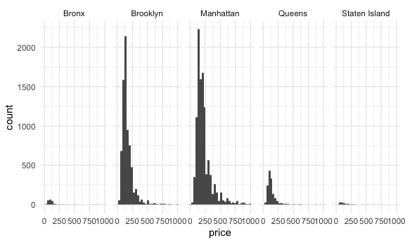
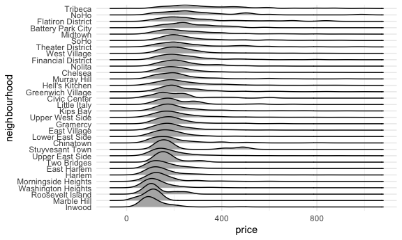
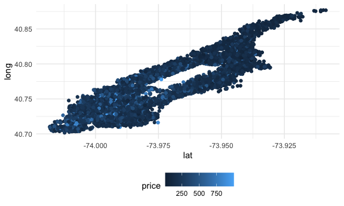

Case Study
================

## Get the data

``` r
library(p8105.datasets)

data(nyc_airbnb)

nyc_airbnb = 
  nyc_airbnb |>
  rename(borough = neighbourhood_group)|>
  mutate(stars = review_scores_location/2)
```

### Brainstorm questions

- Where are AirBNBs expensive?
  - Borough? Neighborhood?
  - Do other factors (room type) affect price? What about rating?
- How long are AirBNBs active?
  - Are AirBNBs illegal and do they get shut down?
- Which units have the most availability?
- How is review score impacted by location?
- How many apts are run by one host?
  - Does that affect price?
  - Does that vary by neighborhood?
- Where are AirBNBs?
  - Borough? Neighborhood?
  - Lat and long?

## Do some EDA

``` r
nyc_airbnb |>
  count(borough)
```

    ## # A tibble: 5 × 2
    ##   borough           n
    ##   <chr>         <int>
    ## 1 Bronx           649
    ## 2 Brooklyn      16810
    ## 3 Manhattan     19212
    ## 4 Queens         3821
    ## 5 Staten Island   261

``` r
nyc_airbnb |>
  group_by(borough, room_type)|> 
  summarize(mean_price = mean(price))|>
  pivot_wider(
    names_from = room_type,
    values_from = mean_price
  )
```

    ## `summarise()` has grouped output by 'borough'. You can override using the
    ## `.groups` argument.

    ## # A tibble: 5 × 4
    ## # Groups:   borough [5]
    ##   borough       `Entire home/apt` `Private room` `Shared room`
    ##   <chr>                     <dbl>          <dbl>         <dbl>
    ## 1 Bronx                      125.           65.5          57.5
    ## 2 Brooklyn                   175.           76.7          59.6
    ## 3 Manhattan                  238.          107.           84.7
    ## 4 Queens                     140.           70.6          49.1
    ## 5 Staten Island              207.           65.4          25

``` r
nyc_airbnb |>
  group_by(borough, room_type)|> 
  summarize(median_price = median(price))|>
  pivot_wider(
    names_from = room_type,
    values_from = median_price
  )
```

    ## `summarise()` has grouped output by 'borough'. You can override using the
    ## `.groups` argument.

    ## # A tibble: 5 × 4
    ## # Groups:   borough [5]
    ##   borough       `Entire home/apt` `Private room` `Shared room`
    ##   <chr>                     <dbl>          <dbl>         <dbl>
    ## 1 Bronx                      100              55            43
    ## 2 Brooklyn                   145              65            40
    ## 3 Manhattan                  190              90            65
    ## 4 Queens                     119              60            39
    ## 5 Staten Island              112.             55            25

``` r
nyc_airbnb|>
  filter(price < 1000, room_type == "Entire home/apt")|>
  ggplot(aes(x = price)) +
  geom_histogram() +
  facet_grid(.~borough)
```

    ## `stat_bin()` using `bins = 30`. Pick better value with `binwidth`.



``` r
nyc_airbnb|>
  filter(price >= 9500)
```

    ## # A tibble: 6 × 18
    ##         id review_scores_location name   host_id host_name borough neighbourhood
    ##      <dbl>                  <dbl> <chr>    <dbl> <chr>     <chr>   <chr>        
    ## 1  3103784                     10 A Pri…  9.83e6 Michael   Brookl… Brooklyn Hei…
    ## 2  4737930                      8 Spani…  1.24e6 Olson     Manhat… East Harlem  
    ## 3   187529                     NA $3200…  9.02e5 Georgia   Manhat… Lower East S…
    ## 4  9528920                      9 Quiet…  3.91e6 Amy       Manhat… Lower East S…
    ## 5 16429718                     NA Charm…  1.36e7 Lena      Brookl… Sheepshead B…
    ## 6 12955683                      8 Great…  3.57e7 Duan      Manhat… Upper West S…
    ## # ℹ 11 more variables: lat <dbl>, long <dbl>, room_type <chr>, price <dbl>,
    ## #   minimum_nights <dbl>, number_of_reviews <dbl>, last_review <date>,
    ## #   reviews_per_month <dbl>, calculated_host_listings_count <dbl>,
    ## #   availability_365 <dbl>, stars <dbl>

``` r
nyc_airbnb |>
  filter(
    price < 1000, 
    room_type == "Entire home/apt",
    borough == "Manhattan") |>
  group_by(neighbourhood) |>
  summarize(
    n_apt = n(),
    mean_price = mean(price)) |>
  arrange(desc(mean_price))
```

    ## # A tibble: 32 × 3
    ##    neighbourhood      n_apt mean_price
    ##    <chr>              <int>      <dbl>
    ##  1 Tribeca              100       358.
    ##  2 NoHo                  61       312.
    ##  3 Flatiron District     75       307.
    ##  4 SoHo                 234       296.
    ##  5 Theater District      93       282.
    ##  6 Midtown              655       276.
    ##  7 Battery Park City     44       271.
    ##  8 Greenwich Village    282       256.
    ##  9 Chelsea              765       255.
    ## 10 Financial District   228       250.
    ## # ℹ 22 more rows

``` r
nyc_airbnb |>
  filter(
    price < 1000, 
    room_type == "Entire home/apt",
    borough == "Manhattan") |>
  mutate(neighbourhood = fct_reorder(neighbourhood, price)) |>
  ggplot(aes(x = price, y = neighbourhood)) +
  geom_density_ridges()
```

    ## Picking joint bandwidth of 26.6



## Try to make a map.

``` r
nyc_airbnb |>
  filter(
    price < 1000, 
    room_type == "Entire home/apt",
    borough == "Manhattan") |>
  ggplot(aes(x = lat, y = long, color = price)) +
  geom_point()
```


\## Try something else entirely

``` r
nyc_airbnb |>
  filter(
    price < 1000,
    room_type == "Entire home/apt",
    borough == "Manhattan") |>
  sample_n(500) |>
  leaflet() |>
  addProviderTiles(providers$CartoDB.Positron)|>
  addCircleMarkers(~lat, ~long, radius = 0.5) 
```

<div class="leaflet html-widget html-fill-item-overflow-hidden html-fill-item" id="htmlwidget-c9c639a5e7514913eeab" style="width:90%;height:345.6px;"></div>
<script type="application/json" data-for="htmlwidget-c9c639a5e7514913eeab">{"x":{"options":{"crs":{"crsClass":"L.CRS.EPSG3857","code":null,"proj4def":null,"projectedBounds":null,"options":{}}},"calls":[{"method":"addProviderTiles","args":["CartoDB.Positron",null,null,{"errorTileUrl":"","noWrap":false,"detectRetina":false}]},{"method":"addCircleMarkers","args":[[40.7233855115898,40.708371992976,40.7151549368336,40.8401757409552,40.7547669749376,40.7279216873886,40.8160715299922,40.7205820790521,40.764269680939,40.7171965259255,40.7296875248981,40.7645157242986,40.7276125058204,40.7441118281221,40.7537086248461,40.7463348062873,40.8020466534738,40.7475849185935,40.7394887832969,40.7239435876537,40.7651062553859,40.7402981558958,40.7389903324108,40.7570297880553,40.746801434324,40.7253462414277,40.7212533035568,40.7026527542654,40.7353058606314,40.7919488971307,40.7837026910486,40.7398519715599,40.7357468652419,40.7252006409981,40.7301742583361,40.7611138385334,40.7793583180576,40.7255258048635,40.7385729162342,40.7109457274432,40.7827953022451,40.77527297385,40.7561392349644,40.803377381319,40.7211619938202,40.7992094862875,40.7428506620476,40.7703470529335,40.7447220949824,40.7883513463258,40.7308806697405,40.7412067478621,40.7723415166441,40.8230631387682,40.8250523633335,40.7280180465477,40.7193201708062,40.7458802873578,40.7322226641243,40.7197672343701,40.7155085876315,40.7602134381178,40.7457162284568,40.7612769854785,40.7610154475432,40.7036509722664,40.8236357834193,40.7564475131655,40.7342557865883,40.7222093356284,40.7280674413927,40.7283389697533,40.7640204109842,40.7923383464232,40.7781555808419,40.7239303798039,40.7425216038826,40.7888631621493,40.7711152759202,40.8014724674878,40.7536836414223,40.7254210046843,40.8619422729056,40.7902450426969,40.7067729110224,40.7348982366938,40.7898723502426,40.7273918604831,40.7719424467527,40.7694697129733,40.759656374212,40.7814517534207,40.7897450128279,40.7655619500383,40.7454436825155,40.7634945679446,40.7794468300033,40.8749443424825,40.7788136389377,40.7395364785071,40.7273336943667,40.7465301941403,40.756805526324,40.8086725102247,40.7769105072525,40.7812397283329,40.7508810053915,40.7771587166946,40.7200756390274,40.7259049505414,40.7675035646835,40.7815219432852,40.7338903137518,40.785582296185,40.7154643603467,40.7778762608181,40.7362919725999,40.7744203351959,40.7754680250698,40.8043390030846,40.7168854091956,40.7955460579858,40.8250210207426,40.797653055577,40.7239182486306,40.7977212260523,40.805175735969,40.7246280771766,40.7621478801774,40.7635934905007,40.8204425556322,40.729196789522,40.7219061955962,40.7459508057455,40.7245263116096,40.7271515643197,40.7188242312529,40.7092001806384,40.765596546549,40.7638855891488,40.8158967178379,40.8119419896065,40.706228434827,40.7343137145869,40.7447876910911,40.8035489572182,40.7625715853416,40.7166829488754,40.7532706558388,40.7243467506631,40.7970291607833,40.7627322128811,40.7777220998187,40.7130121572649,40.7411823338351,40.8231267003472,40.7963220538281,40.7415074129238,40.7596215096511,40.7223065022796,40.7442310615636,40.7306447065342,40.8340080596544,40.7716330890593,40.7502294959426,40.7139528032637,40.7393265290361,40.8636886890753,40.7617919461493,40.8178103818233,40.7264434019759,40.7329199627602,40.7992007533421,40.8133259114301,40.7088740177054,40.7204779514693,40.7560382282886,40.8181603357289,40.7580991709961,40.7388577468034,40.7964655618977,40.8182184665575,40.7311465463903,40.7261125395887,40.7733755366205,40.7276916060404,40.741098865151,40.7269114429696,40.7516925610181,40.7457049411243,40.7473277074364,40.7230116607291,40.7434246550911,40.8253363726659,40.7114000836304,40.7379635779398,40.7997337687965,40.7186892608859,40.7149016017707,40.8348045032671,40.7596140537866,40.7860726750566,40.7318195945996,40.7394300481553,40.7248829405495,40.7458697852759,40.7395535778565,40.8569449604243,40.8031581110552,40.7618843683738,40.7260940636095,40.727793743233,40.7410678296245,40.7508645608366,40.7190017472946,40.7443640621194,40.7663439292197,40.8105679349022,40.7765862262471,40.7808663829842,40.7195663509358,40.7939576179734,40.7377326655862,40.7406646099755,40.7650311807878,40.7553642773956,40.7777452405015,40.7284598308283,40.7384948072471,40.7763334100726,40.7375169905071,40.723784551695,40.7317961760673,40.7833959694159,40.8600014565337,40.7623559462556,40.7914171994425,40.8159300254051,40.7356370302572,40.788219880331,40.7235050294655,40.7771199347197,40.7489304262397,40.7625918014206,40.7666577775137,40.7597971274363,40.7696594870901,40.7785906619358,40.7699147671474,40.765125313233,40.7268133044495,40.7288884097182,40.7444971546367,40.7042768422866,40.7433267584089,40.8021741819774,40.7294220556455,40.7787476074451,40.7628466864905,40.759139840935,40.7378764089658,40.7184030638672,40.7620512772252,40.8203226992117,40.8117588531311,40.7241593639566,40.7414959057175,40.7740198655856,40.7518185582788,40.7251814585434,40.7609840863869,40.7066347637433,40.7261715540327,40.7257611931075,40.7429388276108,40.8010662236854,40.7265239045723,40.7520645806659,40.7897094216075,40.7611657751089,40.8118565315054,40.7880101019266,40.7227177800731,40.7663555443467,40.8058608834422,40.7475377649972,40.7745216569321,40.7560685200292,40.7399095300099,40.782290054683,40.7457020989174,40.7791164326964,40.7317064892176,40.7428335474115,40.7301909307306,40.7891050575247,40.7425869934789,40.7209808336661,40.7279201973304,40.7619186622639,40.7899557706625,40.7652367001491,40.7357151865141,40.7975340903964,40.7280545889031,40.7756253464445,40.767041176786,40.7240007594059,40.7410989117644,40.7343119002379,40.7641276871986,40.752836564513,40.7485539674287,40.7278923512346,40.7887884265585,40.7771858740885,40.7957672196191,40.7643714643618,40.7938737462797,40.8230207697462,40.776142483452,40.7446588345038,40.7739128282105,40.7385030557959,40.7269704462859,40.7644261133169,40.786066497888,40.8134826627463,40.849813325457,40.8284645741707,40.7108080843737,40.7136619314868,40.7364985797243,40.7401852908755,40.7439766706245,40.7198759092173,40.8238859386246,40.7235951322958,40.783046211955,40.7661127747097,40.7474217071187,40.7295900196421,40.737037088675,40.7711667757481,40.7944134608284,40.8071342705553,40.721067301841,40.8053750120597,40.714139832676,40.7362139731979,40.7235124727617,40.7629112582404,40.7262453118439,40.7522224627767,40.7238003049694,40.74280692971,40.7501984367106,40.7635190797329,40.7549855101314,40.7193673500183,40.8388548541501,40.7219136817132,40.7235760980065,40.7223088881598,40.729694362861,40.7390482717136,40.7189046480207,40.7319083787524,40.7937151611332,40.8040287786435,40.7235021001727,40.7049322069497,40.7219461947391,40.7658960729771,40.7860695189656,40.749211402752,40.714116626388,40.8061724370156,40.7817454406754,40.7669435455213,40.7288678086337,40.8097011414345,40.8185786997058,40.7595661278709,40.7311905732809,40.7601543595516,40.7130917379906,40.7623392843382,40.8507812974584,40.755116635008,40.7432928516068,40.7984579730983,40.7064372164587,40.7217411914664,40.7267395510755,40.7488333594692,40.718759299246,40.7582864504482,40.7334854117942,40.7810328321138,40.7280427414761,40.7529581167427,40.8360397092494,40.8552909419166,40.7592100150526,40.776169150719,40.7440598990965,40.7230370036875,40.7475185388548,40.7768575147866,40.7228107084255,40.7461768012541,40.7975708095767,40.7387727604788,40.7664385159916,40.7607224145013,40.7462114617733,40.7671374551386,40.703918844567,40.7390720673696,40.8679269882414,40.8450765417366,40.760606066101,40.8082966427772,40.7269378526483,40.7219982542934,40.7455194102557,40.8047665213818,40.7307998977102,40.7774234466227,40.7785741368074,40.7706541092872,40.738002687722,40.7429163486564,40.7423849131744,40.7333775140443,40.7159569608617,40.7324497639928,40.7175968179612,40.7596654813568,40.7477303883798,40.7740583161665,40.7276459963462,40.7088041256911,40.8283146172715,40.746397960992,40.7744015509074,40.7810149268141,40.7655699073769,40.7318350349132,40.8057282396945,40.752895534196,40.744028540914,40.7402574686789,40.7671975550284,40.7629917538855,40.8040911192252,40.7228852500639,40.7781669931909,40.7637496406701,40.7453029414578,40.7185376087533,40.7299825196,40.7579106261831,40.738978099775,40.8074672912519,40.7133129919255,40.8143750619851,40.7315594180809,40.7668470903099,40.7653053878097,40.7273331044247,40.7465795875621,40.7962225101778,40.7255394285697,40.7779711265846,40.8143264038522,40.7293017374696,40.7464569767359,40.7300002123184,40.8052244048344,40.7372037006764,40.7753557266697,40.7181305343556,40.7439255028496,40.7473791493747,40.7231363784274,40.7221916190755,40.7498590439597,40.7215607474086,40.7273892514618,40.7317544475801,40.7420571136746,40.7776780266403,40.7195362078293,40.760168150575,40.7290784485389,40.7250613664805,40.7371888323162,40.7536484596042],[-73.98329792535721,-74.0060430369244,-73.9908941392013,-73.93524309719101,-73.9936612916062,-74.00322750126939,-73.9604185952376,-73.9867375541268,-73.96200327838341,-73.98400134076731,-73.9998098280775,-73.9943874605662,-73.9877144530268,-73.97423264228721,-73.9733286366031,-73.97456356190111,-73.95427408684,-73.97363603432829,-73.9980120278551,-73.9941538715216,-73.9943195394694,-73.98498039778789,-73.98152830128291,-73.9721686311245,-73.9777948193347,-74.00231440204951,-73.9903471821125,-74.0103999157286,-73.99575169093769,-73.9743433278345,-73.9487744063603,-73.98884989200749,-74.0028878058943,-73.9826096018774,-73.9787901261632,-73.9924823914855,-73.9518774498905,-74.00287459127119,-73.9833502493122,-74.0091180996818,-73.95433425698791,-73.9822269208108,-73.9934116897052,-73.955939449927,-73.99612613222639,-73.9386976746774,-73.9746799342431,-73.9527295036192,-74.00095291895541,-73.9725723519453,-74.0003543926739,-73.9999468360356,-73.94961705319901,-73.9459463623669,-73.95293930914509,-73.9804240561059,-73.99122322100069,-74.00055098851421,-74.00287217635901,-73.9865647524352,-73.9910520283028,-73.9968309546225,-73.9963680598882,-73.99616695166991,-73.9880927179139,-74.0074178949603,-73.9455606250493,-73.99766827610151,-74.0052544846296,-73.9894797175081,-73.9875796389033,-73.9804845381385,-73.9633614546415,-73.96481839447669,-73.95047888472401,-73.98027435832461,-73.99749735382591,-73.9476093207812,-73.94944122813681,-73.9675822053796,-73.9735826852143,-73.98539151486899,-73.9262519196575,-73.9481398132603,-74.0121027105486,-73.9955215426176,-73.9476422155892,-73.9963632893936,-73.95600310284399,-73.9563231666038,-73.9612716910612,-73.9558819936956,-73.970014360276,-73.9950352081067,-73.9785678773526,-73.98985235056131,-73.9797622492882,-73.91057391935141,-73.97725749482279,-74.00501054348609,-73.9879184127807,-73.9963187627102,-73.9971086566801,-73.93831231117311,-73.9476826250292,-73.9522700144493,-73.9823098272409,-73.9477878951964,-73.9840429786652,-73.9953403553192,-73.982279589022,-73.9724919672186,-73.9872365672166,-73.96960118240401,-73.9895996125847,-73.9561527480722,-73.98146656250709,-73.95306987890019,-73.9815369778523,-73.95475851019719,-74.0102379301514,-73.9657783169622,-73.95185685949041,-73.97010004591191,-73.9944869027199,-73.96212777895271,-73.950995048442,-73.99451528564769,-73.9864851104075,-73.98950439593931,-73.9553069453615,-73.98155607654481,-73.9947206838843,-74.0000371150373,-73.99308608205639,-73.9948159950126,-73.9885152367219,-74.00698755204689,-73.98785924308579,-73.9780911442449,-73.9464816577986,-73.9529561314185,-74.0092945691174,-73.9950311341626,-73.9773673759114,-73.9464685110286,-73.99302859151911,-73.99072959255091,-73.9713038398598,-73.9832496358046,-73.9724210722752,-73.96166625915831,-73.98174164983359,-73.9911252677058,-74.0020313624,-73.94982112779491,-73.9687910537493,-73.9838479694837,-73.9918468181381,-73.9950552477128,-73.97613674705531,-73.9993735957629,-73.94254433293411,-73.9609531869888,-73.98293152536159,-73.9895553853197,-74.0031335943075,-73.9285124208311,-73.9577580910032,-73.9611899694839,-73.9840314774473,-73.9870832509379,-73.9708186626105,-73.9445312306708,-74.01337296635511,-74.0099605218375,-73.96809844406491,-73.9430495053379,-73.99539694862899,-73.9794343171915,-73.93117190791919,-73.9409468848735,-73.98992320625121,-73.9790474364077,-73.9869863614678,-73.99192959477629,-73.9792285886674,-73.98533887340921,-73.97173783583099,-74.00366275180571,-73.9953974178692,-74.0025476258869,-73.994833464867,-73.9485466089406,-73.99594580573761,-73.99409518248579,-73.97109978229599,-73.9914063383824,-73.9906271609221,-73.940668588954,-73.9929527308054,-73.973232582679,-74.00999518631851,-73.9942415714569,-73.9799591789663,-73.98160043605159,-73.99986957969659,-73.9348583097411,-73.9654464539624,-73.9653888140267,-73.98356450845451,-73.98990564620139,-73.9993552287969,-73.9977634415102,-74.00784469983699,-73.9729243957082,-73.9871923104954,-73.9456478736714,-73.9506825395907,-73.9781198314251,-73.9936183375691,-73.96575063095641,-74.0018102766487,-73.9989467437489,-73.981774753587,-73.9671473407186,-73.9873216658395,-74.0011291553823,-74.0058942727307,-73.95328831274129,-74.0054919153024,-73.9867209332055,-73.9876432240858,-73.9493007694995,-73.92651988765409,-73.9940705502683,-73.93979945202901,-73.9354481665445,-74.00303075869751,-73.948709492335,-74.0046275228101,-73.9794117678827,-73.9954422470212,-74.0001487665094,-73.95506919036239,-73.9997840136011,-73.95318831518451,-73.9816012915462,-73.95189046974551,-73.9874217081461,-73.97993914435619,-73.9885321044916,-73.9936299444995,-74.01065031125709,-73.9805200628364,-73.9641402105496,-73.9900910343234,-73.94901326866029,-73.959605509895,-73.9659091257728,-73.9804781463137,-73.9880861046672,-73.988707744774,-73.9557793202622,-73.9499938090856,-74.0015672984798,-74.0026696315182,-73.9907341359547,-73.97051729269489,-73.9832546517567,-73.98876320570611,-74.01298062622681,-73.98002419922619,-73.9790776231887,-73.98498556042679,-73.9646938171594,-73.97937828883001,-73.98420369696041,-73.9701928938112,-73.988424481948,-73.94020657171509,-73.9491003090782,-73.9812412840169,-73.9854981432117,-73.9386065487333,-73.9874129900245,-73.9550594706664,-73.98593351366701,-73.99564005631311,-73.9767577789497,-73.99774844274491,-73.9797569513857,-73.99801295197381,-73.9924584320044,-74.00269679188131,-73.973960361938,-73.98885941020821,-73.9949344227465,-73.97945901258259,-73.98817259339221,-73.944629634592,-73.98018272192461,-73.9873475963978,-73.96211170349351,-73.9826144211586,-73.9441870617611,-73.98663952950309,-73.9797912202405,-73.99977737636669,-74.00511313502351,-73.9930103809953,-74.00715116045281,-73.97700171362359,-73.9875607026062,-73.9410950909117,-73.95431105400129,-73.93620016894,-73.99023903142159,-73.9420187433405,-73.9447738653045,-73.9516563535293,-73.9950411409333,-73.9527376320335,-74.00378209451431,-73.98071927014369,-73.9660323054291,-73.9725607710001,-73.9573160813478,-73.9362952451726,-73.9439262432728,-74.0135950019592,-73.9949701577238,-73.9975107412981,-73.9811488724238,-73.9792214084535,-73.98601944291821,-73.9403292162693,-73.9846631388715,-73.9839782566881,-73.9848177424926,-73.9961682290365,-73.98245080106039,-74.010487851698,-73.94665489396399,-73.9307981224302,-73.9471375020744,-73.9803939377467,-73.9676264088551,-73.9924228598874,-74.00612252397769,-73.98283065981251,-73.9859106940096,-74.0019934810615,-73.9727560539044,-74.00497649526589,-73.99969202149499,-73.99111889118041,-73.9910876803774,-73.967292422543,-73.99098236978119,-73.9416139134234,-74.00877678168951,-73.98670222987499,-73.9906850664599,-74.0041799222498,-74.0014047952865,-73.9918209171483,-74.0067923201168,-73.9431612126388,-73.951245870061,-73.97962989064079,-74.0085983315078,-73.9963380508773,-73.9821113503117,-73.9734651138658,-74.0041582370912,-73.9898370535461,-73.9415022051728,-73.95324494427889,-73.954502296106,-73.9844226488771,-73.9425601931862,-73.9559004412248,-73.9867763484296,-74.0061457884357,-73.9637841916601,-74.00395212578491,-73.9873247471766,-73.93302073141101,-73.9682573494414,-74.0027100657684,-73.9421233022008,-74.0078121412099,-73.9963877159488,-74.0030473359535,-73.99609999288271,-73.988505031858,-73.9849845047591,-73.985218655173,-73.95069073753319,-73.9884921434286,-73.98432595905361,-73.940669107006,-73.9397956837676,-73.9889547023698,-73.9818836846552,-73.9827273072118,-73.9769616017179,-73.9766546971546,-73.9550120014426,-73.97767946773121,-73.9912494196553,-73.9408536012115,-73.999756856677,-73.9620438805791,-73.9954686229116,-73.98558370738471,-73.95921829052629,-74.0167794802483,-73.99943316550549,-73.92505432775999,-73.9391658664169,-73.9644370959563,-73.9519753550565,-73.9830380612259,-73.9830208694267,-73.9912012541437,-73.96455336878429,-73.9895409465086,-73.9783966083225,-73.9538967192796,-73.9526947723071,-73.99567000890551,-73.9996892412662,-73.9956680217114,-74.00401130821059,-74.0140083167511,-73.9887262713293,-73.98822516088261,-73.9877066537607,-73.9724698618779,-73.98252493478719,-73.9863424603119,-74.0145532384649,-73.9372655371197,-73.9996498150138,-73.95578114684621,-73.9800797919348,-73.9870035810076,-74.0074225653586,-73.9562983238594,-73.9709363506547,-73.9958112129609,-73.9826386248855,-73.984569139182,-73.9616641336814,-73.94591670182361,-73.9863976739166,-73.9762780638557,-73.9888505319943,-74.00704015141829,-74.0052434405661,-73.982951661302,-73.9832298656972,-73.9823330297578,-73.9603041702665,-73.998219359331,-73.9518306472002,-73.9862677118746,-73.9869774434471,-73.99078336359079,-73.990374219324,-74.00160653119499,-73.96988446703391,-73.9795636197733,-73.9823441854795,-73.9438555986883,-73.99479218648951,-73.9967792512666,-73.98264868288101,-73.9497342838668,-74.004933907222,-73.9780706477642,-73.9923057924621,-73.98341278229231,-73.9756732263412,-73.98491483361801,-73.9840874345101,-73.9799513445391,-73.9967093932574,-73.97823886569,-73.9951824557067,-73.982785013789,-73.9501738238076,-73.98860468503889,-73.9675192682777,-73.979007976769,-73.9886546492678,-74.00739894435129,-73.97151467802971],0.5,null,null,{"interactive":true,"className":"","stroke":true,"color":"#03F","weight":5,"opacity":0.5,"fill":true,"fillColor":"#03F","fillOpacity":0.2},null,null,null,null,null,{"interactive":false,"permanent":false,"direction":"auto","opacity":1,"offset":[0,0],"textsize":"10px","textOnly":false,"className":"","sticky":true},null]}],"limits":{"lat":[40.7026527542654,40.8749443424825],"lng":[-74.0167794802483,-73.91057391935141]}},"evals":[],"jsHooks":[]}</script>
